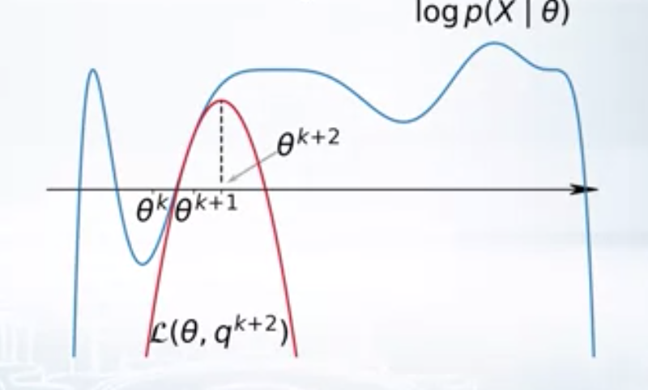

This blog post talks about latent variables, why we need them and how to train latent variable models.

Latent Variables
======

Latent variable is a variable which is never observed (hidden). Why do we need them?
1. Our data might contain missing values
2. We want to know about the uncertainty in our predictions.

Assume you are an HR in a company, and you want to call eligible candidates for interview. Also assume that thevariables for consideration are somethings like GPA, IQ score, Aptitude test score, high school grade etc. Not allcandidates might have taken all the tests, and hence data might contain missing values. Also, we want to quantifyuncertainty in our predictions, so that we can make better decisions about whom to invite for interview. For example,if a candidate is predicted to be a not good fit for the interview, but with high uncertainty, we may as well invitehim for the interview since we are not sure he is not a good fit. To handle these kinds of data we need probabilisticmodels.

Probabilistic model
======

Suppose $$X_1, X_2, X_3$$ are random variables that depends on one another. Now let’s assume each of them taken on one of 100, 200, 300 values respectively. So, the total no of combinations of all variables are 6 million. We can model the joint probability distribution as

$$
        p(x_1, x_2, x_3) = \frac{\exp(-w^Tx)}{Z}
$$

Where $$Z$$ is the normalization constant, which is a sum over all 6 million combinations. This makes the training and inference impractical.

Now let’s introduce a new variable $t$, which we call latent variable and $t$ causes each of RVs $$X_1,X_2,X_3$$. Then,

\\[
\begin{aligned}
    p(x_1,x_2,x_3) &= \int p(x_1, x_2, x_3/t) p(t) dt \newline
                    &= \int p(x_1/t) p(x_2/t) p(x_3/t)p(t) dt \hspace{2ex}\text{(because of independence)}
\end{aligned}
\\]

Each conditional distribution is easy to model now, as the distribution is over 100, 200, 300 values respectively. So, the model complexity is reduced without compromising the flexibility.
Probabilistic models can be used as generating models and can also be used to project data onto a low dimensional latent space.

Probabilistic clustering
------

This is a soft clustering mechanism, which assigns each data point the probability of belonging to a particular cluster. This helps in classifying uncertainty in our cluster assignment.

Gaussian Mixture Model (GMMs)
------

When the data contains several sets of clusters, fitting a Gaussian model to the data is not the best way. Rather, we can use a mixture of Gaussian's which can well model most types of clusters.

  

As you can see in the above image, there are clearly 3 clusters, and a single gaussian fit to the data won't be able to capture the structure in the data. We can use a mixture of 3 gaussians

  

$$
    p(x/\theta) = \sum_{i=1}^{3} \pi_i \mathcal{N}(\mu_i, \sigma_i)
$$

where $$\theta = \{\pi_1, \pi_2, \pi_3, \mu_1, \mu_2, \mu_3, \sigma_1, \sigma_2, \sigma_3\}$$, are parameters of the model.

If we find the parameters $$\theta$$, we can know which cluster each data point came from, also we can generate new data using these parameters. All we need to do is sample from the distribution.
How to find parameters? Use maximum likelihood

Training GMMs
------
Using maximum likelihood principle, the optimization problem is

\\[
\begin{aligned}
\max_{\theta} \quad & p(X/\theta) = \prod_{i=1}^N p(x_i/\theta) = \prod_{i=1}^{N} \sum_{k=1}^{C} \pi_k \mathcal{N}(\mu_k, \sigma_k)\newline
\textrm{s.t.} \quad & \sum_{k=1}^C \pi_k = 1; \pi_k \geq 0\newline
  &\sigma_i > 0    \newline
\end{aligned} 
\\]

We can use SGD to maximize the objective, but it is difficult to enforce the positive definiteness constraint.
Let’s introduce a latent variable $$t$$ here and assume that each data point $$x$$ is generated using some information from $$t$$ i.e. $$t$$ causes $$x$$. Here $$t \in \{1,2,..C\}$$, that is it tells us which Gaussian the given data point come from. $$t$$ is a latent variable, we don’t observe it.

Let the prior distribution on $t$ is $$\pi$$. i.e. $$p(t=c/\theta)= \pi_c$$

The likelihood of  the point $$x$$ belonging to the cluster $$c$$ is $$p(x/t=c,\theta)=  \mathcal{N}(\mu_c,\sigma_c) $$ 

Now  the likelihood under the mixture of Gaussins is

$$
p(x/\theta) = \sum_{k=1}^{C}p(x/t=c,\theta)  p(t=c/\theta)= \sum_{k=1}^{C} \pi_k \mathcal{N}(\mu_k, \sigma_k)
$$

i.e. introducing latent variable has not changed the model. How to estimate parameters $$\theta$$? 

If we know the sources $$t$$, i.e. $$p(t_i/x_i, \theta)$$, we can find the parameters $$\theta$$. i.e. in one dimensional case,

$$
    \mu_c = \frac{\sum_{i} p(t_i=c/x_i, \theta) x_i}{\sum_{i} p(t_i=c/x_i, \theta)}
$$

$$
    \sigma_c = \frac{\sum_{i} p(t_i=c/x_i, \theta) (x_i-\mu_c)^2}{\sum_{i} p(t_i=c/x_i, \theta)}
$$

If we know the parameters $$\theta$$, i.e we can find the sources $$t$$

$$
    p(t=c/x, \theta) = \frac{p(x/t=c, \theta)p(t=c/\theta)}{\sum_{c=1}^C p(x/t=c, \theta)p(t=c/\theta)} 
$$

This is basically a chicken and egg problem. We know neither parameters nor sources.

Expectation-Maximization algorithm
------

1.Start with random Gaussian params $$\theta$$

2.Until convergence, repeat

&nbsp;&nbsp;a). For each point compute $$p(t_i = c/x_i, \theta)$$, probability that the given point comes from cluster c. 

&nbsp;&nbsp;b). Update Gaussian parameters $$\theta$$, to fit points assigned to them.
  
EM algorithm can be faster than SGD and handles the complicated constraints.
EM algorithm suffers from local maxima, i.e. different initialization can lead to different solutions.

Concave-function
------

A function $$f(x)$$ is concave, if $$\forall a, b, 0 \leq \alpha \leq 1$$
$$
    f(\alpha a + (1-\alpha b))  \geq \alpha f(a) + (1-\alpha) f(b)
$$

  

In general $$\forall a_1, a_2,..a_n$$

$$
    f(\alpha_1 a_1+\alpha_2 a_2+...+\alpha_n a_n) \geq \alpha_1 f(a_1) + \alpha_2 f(a_2)+...+ \alpha_n f(a_n) \label{eq1}
$$

If we assume a RV $$t$$, such that $$p(t=a_i)= \alpha_i$$, then the inequality (\ref{eq1}) can be written as

$$
    f(\mathbf{E}_{p(t)} t ) \geq \mathbf{E}_{p(t)} (f(t)) \label{eq2}
$$
	
(\ref{eq2}) is called Jensen's inequality.

$f(x) = \log(x)$ is a concave function. Concave functions have only one global maxima.

Kullback-Leibler Divergence
------
 

  

In the above image, even though the parametric difference between the distributions is same, the second set of distributions are closer to each other when compared to that of first set. KL divergence would reflect this in its value.

KL divergence is a measure of how a probability distribution is different from a reference probability distribution. For $$p$$ and $$q$$, discrete probability distributions on the same space $$\mathcal{X}$$, it is defined as
 
 \\[
 \begin{aligned}
     KL(q || p) &= \sum_{x \in \mathcal{X}} q(x) log (\frac{q(x)}{p(x)}) \newline
                &= \mathbf{E}_{q} log(\frac{q}{p})
 \end{aligned}
 \\]

In other words, it is the expectation of the logarithmic difference between the probabilities $$q$$ and $$p$$, where the expectation is taken using the probabilities $$q$$. For continuous distributions, sum is replaced by integration. Some properties are

1. KL divergence measure is not symmetric, and hence not a metric. 
$$KL(q || p) \neq KL(p || q)$$.
2. For identical distributions $$q$$ and $$p$$,
$$KL(q || p) = 0$$
3. Non-negative, 
$$KL(q || p) \geq 0$$

General from of EM
------
Maximum Likelihood objective of EM algorithm is

\\[
\begin{aligned}
    \max_{\theta}. \log p(X/\theta) &= \log \prod_{i=1}^N p(x_i/\theta) \newline
                                   &= \sum_{i=1}^N \log(p(x_i/\theta)) \newline
                                   &= \sum_{i=1}^{N} \log (\sum_{c=1}^C p(x_i, t_i=c/\theta))
\end{aligned}
\\]

Now let's introduce a new distribution $$q$$ on latent variables $$t$$, such that we can form a family of variational lower bounds on the objective function.

\\[
\begin{aligned}
log p(X/\theta) &= \sum_{i=1}^N \log p(x_i/\theta) \newline
    &= \sum_{i=1}^{N} \log \left(\sum_{c=1}^C p(x_i, t_i=c/\theta)\right) \newline
    &= \sum_{i=1}^{N} \log \left(\sum_{c=1}^C \frac{q(t_i=c)}{q(t_i=c)}p(x_i, t_i=c/\theta)\right) \newline
    &\geq \sum_{i=1}^N \sum_{c=1}^C q(t_i=c).\log\left(\frac{p(x_i, t_i=c/\theta)}{q(t_i=c)}\right)  \hspace{4ex}\text{  since} \hspace{1ex} \log\left(\sum_c \alpha_c\nu_c\right) \geq \sum_c \alpha_c \log(\nu_c) \newline
    &= L(\theta, q)
\end{aligned}
\\]

Here $$L(\theta, q)$$ is a family of variational lower bonds. varying $$q$$ gives different lower bounds. For a given $$\theta_k$$, we can to choose the $$q_{k+1}$$ such that $$L(\theta_k, q)$$ is the best lower bound, i.e. $$q_{k+1} = argmax_q L(\theta_k, q)$$. Once we found $$q_{k+1}$$, we find the best parameters w.r.to the best lower bound, i.e. $$\theta_{k+1} = argmax_{\theta} L(\theta, q_{k+1})$$. EM algorithm performs these two steps repeatedly. First, finding the best lower bound for the given parameters and second, optimizing the parameters with respect to the best lower bound.

Solarized dark             |  Solarized Ocean
:-------------------------:|:-------------------------:
  |   

E-step
------

$$
    \log p(X/\theta) \geq L(\theta, q)
$$

We want to find the best lower bound w.r.to the given params $$\theta_k$$. This is same as minimising the gap between the original log likelihood and the lower bound. i.e. 

\\[
\begin{aligned}
    GAP &= \log p(X/\theta) - L(\theta, q) \newline
        &= \sum_{i=1}^N \log p(x_i/\theta) - \sum_{i=1}^N \sum_{c=1}^C q(t_i=c).\log\left(\frac{p(x_i, t_i=c/\theta)}{q(t_i=c)}\right)  \newline
        &= \sum_{i=1}^N \left( \log p(x_i/\theta) \sum_{c=1}^C q(t_i=c) - \sum_{c=1}^C q(t_i=c) \log\left(\frac{p(x_i, t_i=c/\theta)}{q(t_i=c)}\right) \right) \newline
        &= \sum_{i=1}^N \sum_{c=1}^C q(t_i=c) \left( \log p(x_i/\theta) - \log\left(\frac{p(x_i, t_i=c/\theta)}{q(t_i=c)}\right) \right) \newline
        &= \sum_{i=1}^N \sum_{c=1}^C q(t_i=c) \left( \log\left(\frac{p(x_i/\theta) q(t_i=c)}{ p(x_i, t_i=c/\theta)}\right) \right) \newline
        &= \sum_{i=1}^N \sum_{c=1}^C q(t_i=c) \log \frac{q(t_i=c)}{p(t_i=c/x_i, \theta)} \newline
        &= \sum_{i=1}^N KL\left(q(t_i) || p(t_i/ x_i, /\theta)\right) \geq 0
\end{aligned}
\\]

Now,

\\[
\begin{aligned}
    \max_q L(\theta_k, q) &= \min_q \sum_{i=1}^N KL\left(q(t_i) || p(t_i/x_i, \theta)\right) \newline
\end{aligned}
\\]

Since the gap is always non-negative, minimising the gap w.r.to variational parameter $q$ implies $$q(t_i) = p(t_i/x_i, \theta)$$, which is a posterior distribution on latent variable $$t$$. Therefore, E-step reduces to

$$
    q_{k+1} = argmax_{q(t_i)} L(\theta_k, q(t_i)) = p(t_i/x_i, \theta_k)
$$

M-step
------

\\[
\begin{aligned}
    \max_{\theta} L(\theta, q) &= \sum_{i=1}^N \sum_{c=1}^C q(t_i=c).\log \frac{p(x_i, t_i=c/\theta)}{q(t_i=c)} \newline
    &= \sum_{i=1}^N \sum_{c=1}^C q(t_i=c) \log p(x_i, t_i=c/\theta) - \sum_{i=1}^N \sum_{c=1}^C q(t_i=c) \log q(t_i=c) \newline
    &= \max_{\theta}. \mathbf{E}_{q} \log p(X,T/\theta)
\end{aligned}
\\]

The function $$\log p(X,T/\theta)$$ is usually concave, so it'd be easy to maximize w.r.to $$\theta$$. Easier when compared to the original maximum likelihood optimisation problem.

Convergence Guarantees
------
$$
    \log p(X/\theta_{k+1}) \geq L(\theta_{k+1}, q_{k+1}) \geq L(\theta_{k}, q_{k+1}) = \log p(X/\theta_{k})
$$

i.e. marginal log likelihood never decreases during an iteration of an EM algorithm, which means EM algorithm never makes things worse. This property is very useful in debugging the implementation. At least guaranteed to converge to a local maxima.

EM applied to GMM
------

E-step
------

$$
    q(t_i=c) = p(t_i=c/x_i, \theta)
$$

where $$x_i$$ is the $$i^{th}$$ data point and $$\theta = \{\pi_i, \mu_i, \sigma_i\}_{i=1,2,..C}$$

M-step
------

$$
    \theta = argmax_{\theta}  \mathbf{E}_{q} \log p(X, T/\theta) 
$$

$$
    \mathbf{E}_{q} \log p(X, T/\theta) = \sum_{i=1}^N \sum_{c=1}^C q(t_i=c) \log p(x_i/t_i=c, \theta) p(t_i=c/\theta)
$$

$$
    \mathbf{E}_{q} \log p(X, T/\theta) = \sum_{i=1}^N \sum_{c=1}^C q(t_i=c) \log \left(\frac{1}{Z} \exp(-\frac{(x_i-\mu_c)^2}{2\sigma^2}) \pi_c \right)
$$

$$
    \mathbf{E}_{q} \log p(X, T/\theta) = \sum_{i=1}^N \sum_{c=1}^C q(t_i=c) \left(\log \frac{\pi_c}{\sqrt{2*\pi*\sigma^2}} - \frac{(x_i-\mu_c)^2}{2\sigma^2} \right)
$$

Equating partial derivative w.r.to $$u_k, \sigma_k, \pi_k; 1\leq k \leq C$$ to zero gives

\\[
\begin{aligned}
    \mu_k &= \frac{\sum_{i=1}^N q(t_i=k) x_i}{\sum_{i=1}^N q(t_i=k)} \newline
    \sigma_k &= \frac{\sum_{i=1}^N q(t_i=k) (x_i-u_k)^2}{\sum_{i=1}^N q(t_i=k)} \newline
    \pi_k &= \frac{\sum_{i=1}^N q(t_i=k)}{N}
\end{aligned}
\\]

