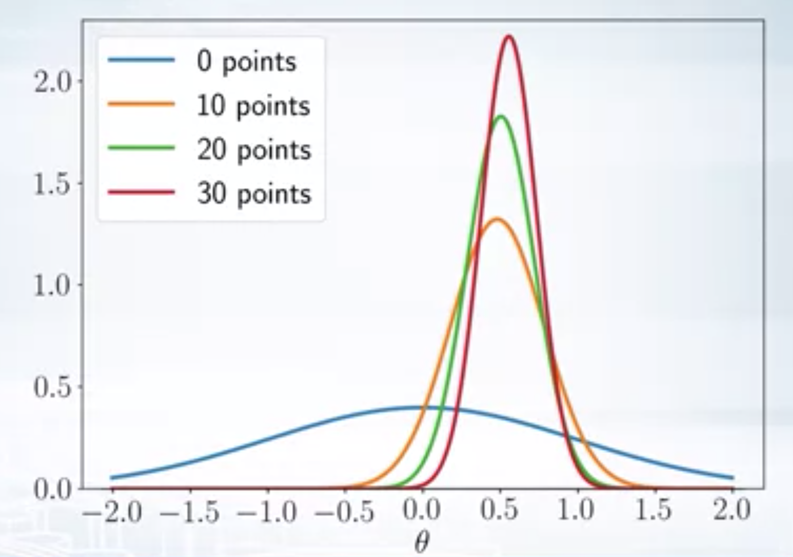
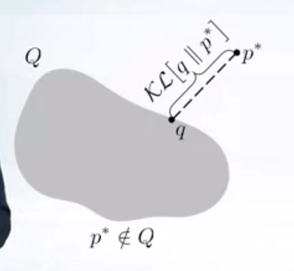

This blog post talks about Bayesian view of statistics and the need for variatinal inference and a simple Mean Field approximation method

Bayesian view of statistics
======

Traditional ML methods treats model parameters as constants, and tries to find them using maximum likelihood principle. Here the model parameters $\theta$ are just unknown, not random. This view of $\theta$ as being constant, but unknown value is taken in frequentist statistics. An alternate approach to parameter estimation is Bayesian view which treats model parameters as random variables with unknown values. The following can be considered as main ideas of Bayesian view. 
1. Use prior knowledge 
2. Choose answers that explains the observations mostly 
3. Avoid making extra assumptions (Occam's razor)

Baye's Theorem 
------

Let $$\theta$$ --> parameters, $$X$$ --> observations

$$
    \underbrace{p(\theta/X)}_{Posterior} = \frac{\overbrace{p(X/\theta)}^{Likelihood}\overbrace{p(\theta)}^{Prior}}{\underbrace{p(X)}_{Evidence}}
$$

In the above formulae,
$$p(\theta)$$ --> prior information that we have on parameters 
$$p(X/\theta)$$ --> Likelihood (How well our params explains observations) 
$$p(\theta/X)$$ --> Posterior (How well the data explains the params)
$$p(X)$$ ---> Evidence (How likely to observe the given data, can only be calculated if we have a model that can generate the data)

Bayesian methods tries to find the distribution over the model parameters, after observing the data (posterior). In case of 

Training
------

$$
    p(\theta/ X_{tr}, y_{tr}) = \frac{p(y_{tr}/X_{tr}, \theta) p(\theta)}{p(y_{tr}/X_{tr})}
$$

Inference
------

$$
    p(y_{ts}/X_{ts}, X_{tr}, y_{tr}) = \int_{\theta} p(y_{ts}/X_{ts}, \theta) p(\theta/ X_{tr}, y_{tr}) d\theta
$$

By choosing a proper prior, we can embed our prior knowledge into the model and hence prior can be used as a regularizer. Bayes theorem can also be used for online training.

$$
   \underbrace{p_k(\theta)}_{New prior} =  \underbrace{p(\theta/x_k)}_{Posterior} = \frac{\overbrace{p(x_k/\theta)}^{Likelihood}\overbrace{p_{k-1}(\theta)}^{Prior}}{\underbrace{p(x_k)}_{Evidence}}
$$

On every iteration, we get new data and we use the posterior from the previous iteration as prior for the current iteration. Our posterior becomes more and more accurate with the incoming evidence over iterations.

  

Analytical Inference
------

The denominator in the Baye's theorem is the evidence term $$p(X)$$ is difficult to model, so calculating posterior distribution in closed form is not possible. Therefore, we approximate the posterior in general. One common approach is to replace the posterior with a single point estimate. The MAP (Maximu A Posteriori) estimate of $$\theta$$ is given by

\\[
\begin{aligned}
    \theta_{MAP} &= argmax_{\theta} p(\theta/X) \newline
                 &= argmax_{\theta} p(X/\theta) p(\theta)
\end{aligned}
\\]

Conjugate distributions
------

Prior $$p(\theta)$$ is conjugate to the likelihood $P(X/\theta)$ if the posterior and prior lies in the same family of distributions.
For example, let both prior and likelihood are normal distributions with $$p(\theta) = \mathcal{N}(\theta/m,s^2)$$ and $$p(X/\theta) = \mathcal{N}(X/\theta, \sigma^2)$$

$$
    \underbrace{p(\theta/X)}_{\mathcal{N}(a, b^2)} = \frac{\overbrace{p(X/\theta)}^{\mathcal{N}(X/\theta, \sigma^2)}\overbrace{p(\theta)}^{\mathcal{N}(\theta/m, s^2)}}{p(X)}
$$

i.e. if we choose prior that's conjugate to the likelihood, we can avoid computing the evidence, since the posterior belongs to the prior family of distributions.

Let the likelihood be Bernouli, and prior be beta, then

\\[
\begin{aligned}
    p(X/\theta) &= \theta^{N_1}(1-\theta)^{N_0} \newline
    p(\theta) &= B(\theta/a,b) \propto \theta^{a-1} (1-\theta)^{b-1} \newline
    p(\theta/X) &\propto p(X/\theta) p(\theta) \newline
                &\propto \theta^{N_1+a-1} (1-\theta)^{N_0+b-1} \newline
                &= B(N_1+a, N_0+b)
\end{aligned}
\\]

i.e we calculated the exact posterior without calculating the evidence.

Variational Inference
------

$$
    p^*(z) = p(z/X) = \frac{p(X/z) p(z)}{p(X)} = \frac{p(X/z) p(z)}{\int p(X/z) p(z) dz} = \frac{\hat{p}(z)}{Z}
$$

Here $$\hat{p}(z)$$ is the un-normalized posterior and $$Z$$ is the normalization constant.

Computing the posterior using Bayes formula in closed form (analytical expression) is not possible in many cases because of intractable integrals involved in calculating the evidence. Only when likelihood and prior are conjugate to each other, this is possible. So, there is a need to approximate the posterior distribution. Variational inference is an idea to approximate the posterior using other simple known distributions. The main idea behind variational inference is as follows

1. Pick a family of distributions $$Q$$ over latent variables with variational parameters. Let's call this as variational family 
2. Find the variational params such that $q(z)$ is the best approximation to the posterior $$p^*(z)$$.

$$
    KL(q(z) || p^{*}(z)) --> \min_{q \in Q}
$$

3. Use the $$q(z)$$ with fitted parameters as an approximation to the posterior,e.g. to from predictions over future data etc. 
Typically, true posterior does not lie in the variational family. 

  

\\[
\begin{aligned}
    KL(q(z) || p^{*}(z)) &= KL(q(z) || \frac{\hat{p}(z)}{Z}) \newline
                        &= \int q(z) \log\frac{q(z)}{\hat{p}(z)/Z} \newline
                        &= \int q(z) \log\frac{q(z)}{\hat{p}(z)} + \int q(z) \log Z dz \newline
                        &= KL(q(z) || \hat{p}(z)) + \log Z 
\end{aligned}
\\]

So, we only need to approximate unnormalized posterior.

Mean Field Approximation
------

1. In mean field variational inference, we assume that the variational family factorizes over the dimensions of latent variable.

$$
    Q = \{ q; q(z) = q(z_1, z_2,...z_d) = q_1(z_1) q_2(z_2)...q_d(z_d)\}
$$

&nbsp;&nbsp;&nbsp;for example

$$
    p^*(z_1, z_2) \approx q_1(z_1) q_2(z_2)
$$

2. Find best approximation $$q(z)$$ of $$p^*(z)$$. We will use *Coordinate ascent* algorithm, iteratively optimizing each variational distribution, keeping the others fixed.

\\[
\begin{aligned}
KL \left(q(Z) || p^*(Z)\right) &= KL\left(\prod_{i=1}^{d} q_i(z_i) || p^*(Z)\right) \newline
&= \int \prod_{i=1}^{d} q_i \log \frac{\prod_{i=1}^{d} q_i}{p^*} dZ
\end{aligned}
\\]

\\[
\begin{aligned}
KL \left(q(Z) || p^*(Z)\right=\quad&  KL\left(\prod_{i=1}^{d} q_i(z_i) || p^*(Z)\right)\newline
=\quad & \theta \quad + \quad \alpha\times\underset{j}{\sum}\nabla_{\mu_\theta} Q(s_j,\mu_\theta(s_j)) \times \nabla_{\theta}\mu_\theta(s_j)  \newline
 =\quad & \theta \quad+\quad\alpha\times\underset{j}{\sum}\nabla_{a} Q(s_j,a)\times\nabla_{\theta}\mu_\theta(s_j)
 \end{aligned}
\\]

$$
\int \prod_{i=1}^{d} q_i \log \frac{\prod_{i=1}^{d} q_i}{p^*} dZ
$$

$$
\sum_{i=1}^d \int \prod_{j=1}^{d} q_j \log q_j dZ - \int \prod_{j=1}^{d} q_j \log p^* dZ
$$

$$
\int \prod_{j=1}^{d} q_j \log q_k dZ + \sum_{i \neq k} \int \prod_{j=1}^{d} q_j \log q_i dZ - \int \prod_{j=1}^{d} q_j \log p^* dZ
$$

$$
\int q_k \log q_k \underbrace{\left( \int \prod_{j \neq k} q_j dZ_{\neq k}\right)}_{1} dz_k + \sum_{i \neq k} q_i \log q_i \underbrace{\left( \int \prod_{j \neq i} q_j dZ_{\neq i}\right)}_{1} dz_i - \int \prod_{j=1}^{d} q_j \log p^* dZ
$$

$$
\int q_k \log q_k dz_k + \sum_{i \neq k} q_i \log q_i dz_i - \int q_k \left( \prod_{j \neq k} q_j \log p^* dZ_{\neq k} \right) dz_k
$$

$$
\int q_k \left( \log q_k - \underbrace{\int \prod_{j \neq k} q_j \log p^* dZ_{\neq k}}_{h(z_k) = \mathbf{E}_{q_{-k}} \log p^* } \right) dz_k + \sum_{i \neq k} q_i \log q_i dz_i
$$

Minimizing the KL divergence w.r.to $$q_k$$ gives

$$
    \log q_k = h(z_k) = \mathbf{E}_{q_{-k}} \log p^* 
$$

