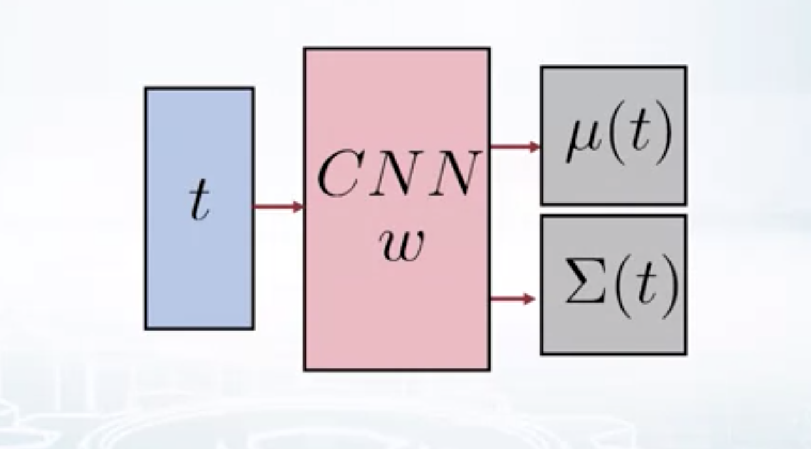
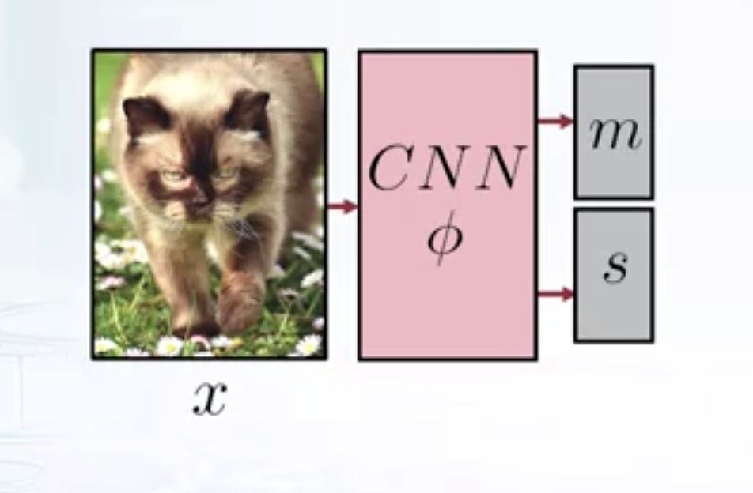
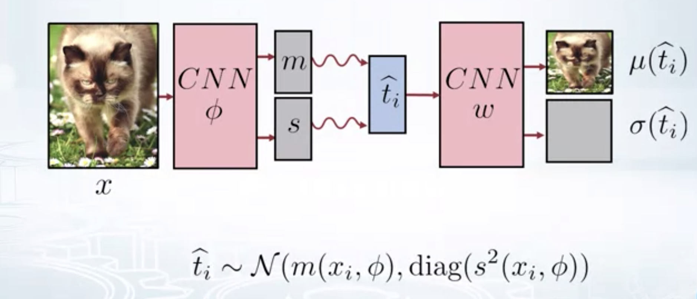
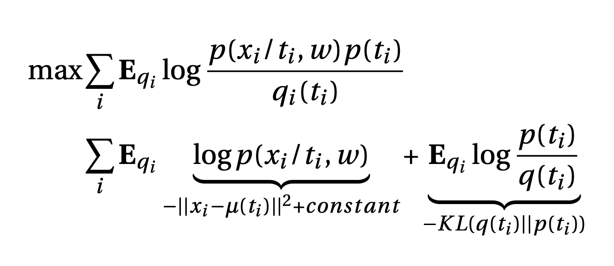
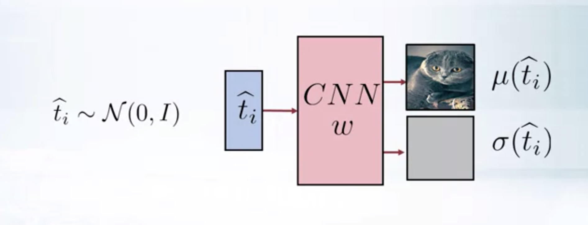
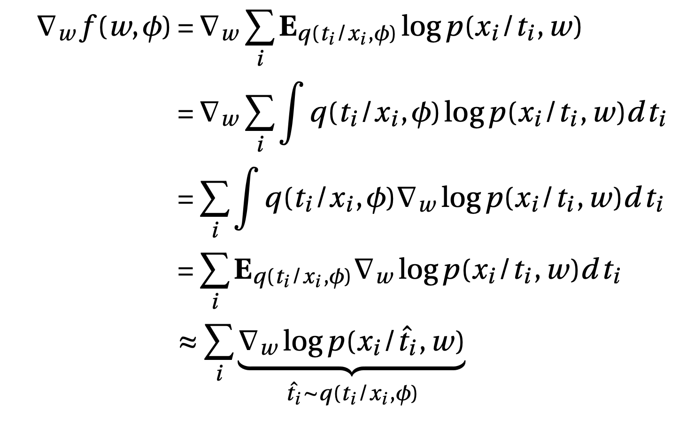
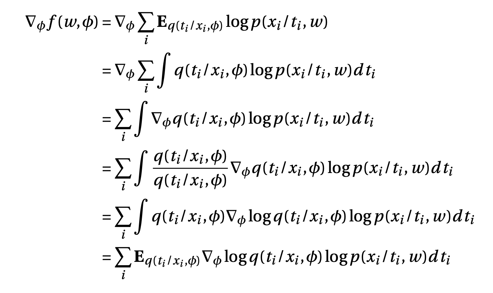
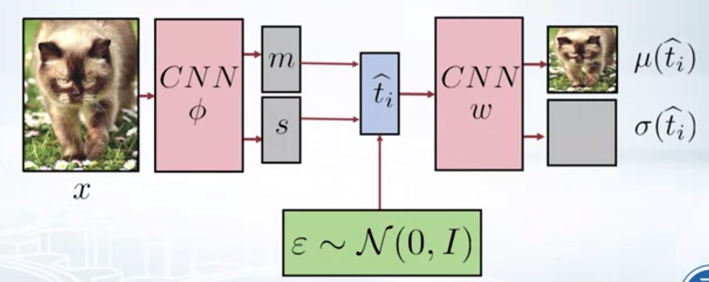
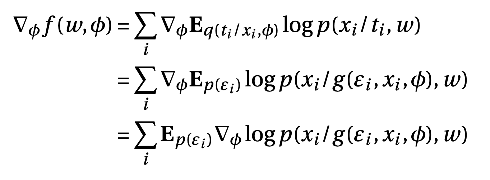

This blogpost talks about modelling the distribution of images, the challenges in modelling and training etc.  Let's try to fit a model $$p(x)$$ to a set of images, just like we tried to fit GMM to a set of points in some dimensional space.

why model $$p(x)$$ for images?
======
Modelling the distribution of images has the following advantages.
 1. We can represent the data in a compact form using model parameters. Typically the latent dimension is much lesser compared to the input dimension.
 2. We can use the model to generate new samples (images in this case).
 3. Model can be used to detect anomalies/outliers by predicting the probability of the data point according to the model.

How to model distribution of images?
------

 1. Use the CNN to model the images,i.e.

    \\[
       \begin{aligned}
        \log \hat{p}(x) &= CNN(x) \newline
                   p(x) &= \frac{\exp(CNN(x))}{Z} \newline
        \end{aligned}
    \\]

      - The problem is the normalization constant, the sum of probabilities should be 1 w.r.to all possible images. i.e. to calculate $$Z$$ we have to use every possible natural image. So, this approach is not feasible
 
 2. Use chain rule and model conditional distribution 
 
    $$
    p(x_1, x_2,...x_n) = p(x_1) p(x_2/x_1)...p(x_n/x_1,x_2...x_{n-1}) 
    $$

    - The joint distribution over the pixels can be modelled using the conditional distributions. For a $$100 X 100$$ gray scale image, the model is a factorized over 10k conditional distributions. So, each conditional distribution needs to be normalized using only 256 values. We can model any probability distribution in this way. Conditional distribution can be modelled using RNN as 
    $$
    p(x_n/x_1,x_2...x_{n-1}) = RNN(x_1,x_2...x_{n-1}) 
    $$

    - The model reads the image pixel by pixel and generates the distribution over the next pixel. This model takes too long to generate even a low resolution image.

 3. We can model the distribution of pixels in an image as independent, but since that's not the case, the images generated by the model doesn't resemble the images in the data set.

 4. Mixture of several Gaussians (GMM)

    - Theoretically GMM can model any distribution, but in practice it can be inefficient for complicated data sets like images. GMM in this case may fail to capture the structure in the data, since it's too difficult to train.

 5. Mixture of infinitely many Gaussians

    $$
    p(x) = \int p(x/t) p(t) dt
    $$

    - Here $$t$$ is a latent variable, and $t$ is assumed to cause $$x$$. $$p(x/t)$$ can be modelled as Gaussian. Even if the Gaussians are factorized, i.e. have independent components for each dimension, mixture is not. Hence, this model is a bit more powerful than the GMM model.

Let's explore the idea of representing an image as infinite mixture of Gaussians.

$$
        p(x) = \int p(x/t) p(t) dt
$$

Let's model the likelihood $$p(x/t)$$ to be Gaussian and prior to be standard normal, then

$$
    p(t) = \mathcal{N}(0, I) \\
$$

$$
    p(x/t) = \mathcal{N}(\mu(t), \sigma(t)) 
$$

If we use CNN with parameters $$w$$ to model the likelihood, then,

$$
    p(x/w) = \int p(x/t, w) p(t/w) dt
$$

$$
    p(t) = \mathcal{N}(0, I)
$$

$$
    p(x/t, w) = \mathcal{N}(\mu(t, w), \sigma(t, w))
$$

  

For a $$100 X 100$$ image, covariance matrix to be generated by our CNN would be of dimension 10k X 10k which is huge. To avoid this, let's model the covariance matrix as diagonal.

$$
p(x/t, w) = \mathcal{N}(\mu(t, w), diag(\sigma^2(t, w)))
$$

This is same as modelling our images as a mixture of factorised Gaussian distributions. This is better than modelling as just the factorised distributions. Since our model is fully defined, let's look into the training part. The ML training objective is to 

$$
    \max_w. p(X/w) = \int p(X/T,w) p(T) dt
$$

Since our model is a latent variable model, let's use EM. EM builds a variational lower bound and maximises it w.r.to both variational and model parameters.

$$
    \log p(X/w) \geq \mathcal{L}(w,q)
$$

$$
    \max_{w,q} \mathcal{L}(w,q)
$$

but the E-step contains finding the posterior on latent variables i.e. $$p(T/X,w)$$, which is intractable. We can variational EM. Here, the idea is to maximize the same variational lower bound, bound with factorized distribution over latent variables. Each variational distribution is independent of another, i.e. the objective becomes

\\[
\begin{aligned}
\max_{w, q_1,q_2...q_N} \quad & \mathcal{L}(w, q_1, q_2..q_N) \newline
\textrm{s.t.} \quad & q_i(t_i) = q_{i1}(t_{i1}) q_{i2}(t_{i2})...q_{im}(t_{im})
\end{aligned} 
\\]

Unfortunately, this introduces a lot of variables for each data point and it's unclear how to find the variational distribution params for test data points. So, let's introduce a new network that gives a variational distribution over latent variables given the data point. This way all the distributions all independent and depends only on the given data point $$x$$. Also, let the distribution be Gaussian, then the objective becomes

\\[
   \begin{aligned}
\max_{w, \phi} \quad & \mathcal{L}(w, q_1, q_2..q_N)\newline
\textrm{s.t.} \quad & q_i(t_i) = \mathcal{N} (m(x_i, \phi), s^2(x_i, \phi))
    \end{aligned} 
\\]

  

Here each $$q_i$$ is different from one another, but they all share the same parametrization. We can use a CNN to find the mean and variance of variational distribution. Since the variational distribution is modelled as Gaussian, it's be easy to sample from this distribution and this is very useful since the variational lower bound contains the expectation w.r.to the variational distribution.

\\[
   \begin{aligned}
\max_{w, \phi} \quad & \sum_{i} \mathbf{E}_{q_i} \log \frac{p(x_i/t_i,w) p(t_i)}{q_i(t_i)}\newline
\textrm{s.t.} \quad & q_i(t_i) = \mathcal{N} (m(x_i, \phi), s^2(x_i, \phi))\\
    \end{aligned} 
\\]

Now this complete workflow is called a Variational Auto Encoder. It contains an encoder and a decoder. Encoder takes the image and gives the distribution over latent dimensions. Sample from this distribution and feed it to decoder. Decoder tries to reconstruct the image that is as close to the input image as possible. If we set the variance of latent distribution to zero, the resultant architecture is called an Auto Encoder. 

  

Now, let's look at the maximisation objective closely.

  

The first term can be interpreted as trying to push $$\mu(t_i)$$ as close to input image $x_i$ as possible. This is called reconstruction loss. The second term is the KL divergence between prior and variational distribution.i.e. we are trying to push $$q(t_i)$$ is be as close to $$p(t_i)$$ as possible. KL divergence term pushes the $$q(t_i)$$ to be non-deterministic, since if the variance of $$q(t_i) = 0$$, KL loss will be infinity. This helps in keeping some noise in the structure. After training, VAE can be used to generate new images by using the decoder by feeding a sample from standard normal distribution (prior).

  

VAE can also be used to detect images that are very different from the training distribution, by using the KL divergence between prior and variational distribution as a measure.

Gradient of Decoder
------

our objective is

$$
    \max_{w, \phi} \sum_{i} \mathbf{E}_{q_i} \log p(x_i/t_i,w) - \mathcal{KL}(q(t_i)||p(t_i))
$$

The KL term can be computed analytically, so gradients w.r.to this term can be calculated easily.

$$
    \mathcal{KL}(q_i(t_i)||p(t_i)) = \sum_j \left( -\log\sigma_j(t_i) + \frac{\sigma^2_j(t_i) + \mu_j^2(t_i)-1}{2}\right)
$$

Now, the first term

$$
    f(w, \phi) = \sum_i \mathbf{E}_{q(t_i/x_i, \phi)} \log p(x_i/t_i,w) 
$$

Gradient w.r.to the first term

  

i.e. Feed the image to encoder, get the variational parameters. Sample from variational distribution, find the gradient and average the gradients to approximate the expectation.

Gradient of Encoder
------

  

One problem here is that variance of this gradient could be very high because of the term $$\log p(x_i/t_i,w)$$ which could be very high, since any image is highly unlikely under our model in the initial phase of training. To avoid this problem we use the reparametrization trick.

Instead of directly sampling $$\hat{t_i}$$ from the posterior with mean $m$ ans variance $s^2$, we can first sample from standard normal and then convert it to sample from posterior, i.e.

  

$$
    \hat{t_i} \sim q(t_i/x_i, \phi) = \mathcal{N} (m_i, diag(s^2))
$$

$$
    \hat{t_i} = \varepsilon_i \odot s_i + m_i = g(\varepsilon_i, x_i, \phi)
$$

$$
    \varepsilon_i \sim p(\varepsilon_i) = \mathcal{N}(0, I)
$$

Now, the gradient can be written as

  


This is simply the expectation of gradient of VAE w.r.to encoder parameters $\phi$, where expectation is w.r.to the standard normal. 

