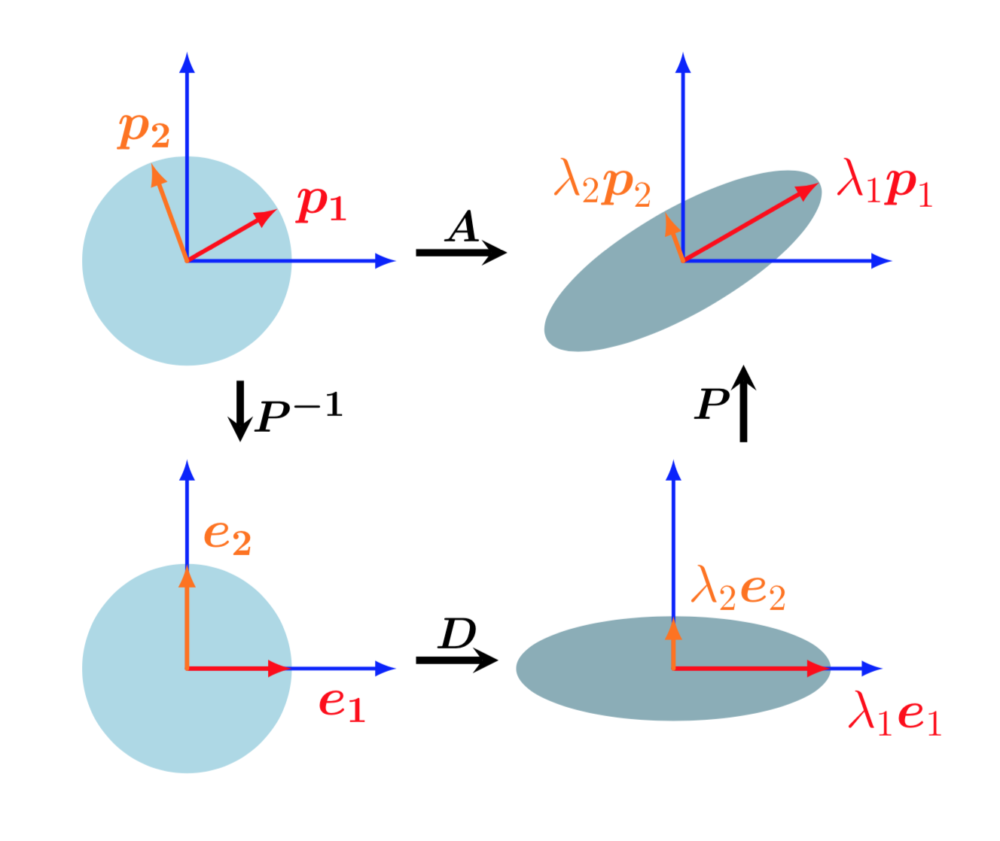
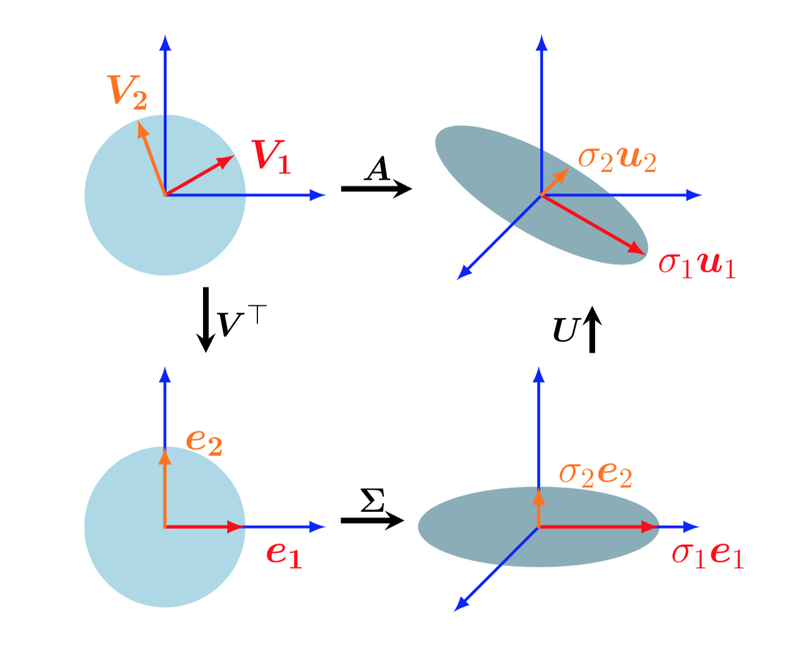
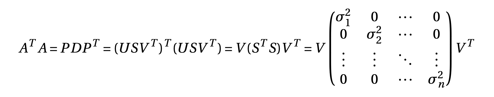
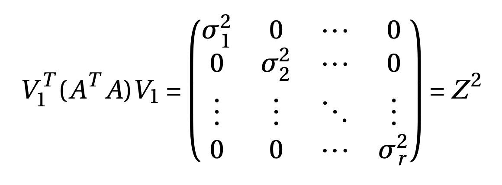
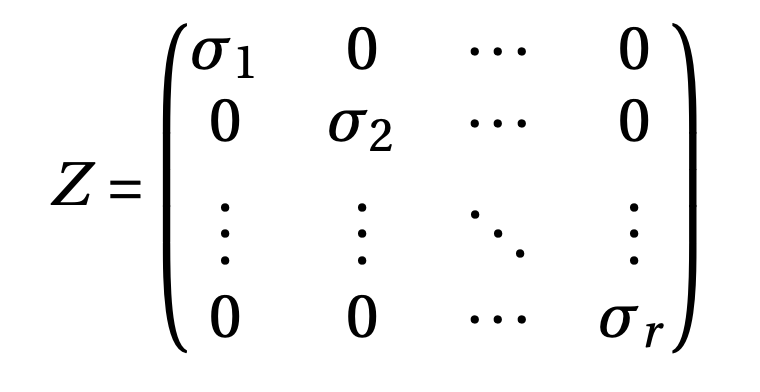

This blogpost talks about linear transformation and geometric intuitions of matrices, change of basis, eigen decomposition and singular value decomposition.

Linear mapping
------
Vectors are objects that can added together multiplied by a scalar and the resulting object is still a vector. Consider two vector spaces $$v, W$$. A mapping $$ \phi : V \rightarrow W$$ preserves the structure of vector space if for all $$x,y \in V$$ and $$\alpha \in \mathbb{R}$$.

\\[
\begin{aligned}
    \phi(x+y) &= \phi(x) + \phi(y) \\
    \phi(\alpha x) &= \alpha \phi(x)
\end{aligned}
\\]

This mapping is also called linear mapping. It can be summarized as

$$
    \forall x, y \in V, \forall \alpha, \beta \in \mathbb{R}: \phi(\alpha x + \beta y) = \alpha \phi(x) + \beta \phi(y) 
$$

We can represent linear mappings/transformations as matrices. Consider a mapping $$\phi : V \rightarrow W$$, where $$V, W$$ are arbitrary sets, Then the mapping $$\phi$$ is called

1. *Injective* if $$\forall x, y \in V: \phi(x)=\phi(y) \implies x=y$$
2. *Surjective* if $\phi(V) = W$
3. *Bijective* if both injective and surjective

The following are special cases of linear mappings between vector spaces $$V$$ and $$W$$:

1. *Isomorphism* if $$\phi: V \rightarrow W$$ is linear and bijective
2. *Endomorphism* if $$\phi: V \rightarrow V$$ is linear.
3. *Automorphism* if $$\phi: V \rightarrow V$$ is linear and bijective.

Consider the vector spaces $$V, W$$ with corresponding ordered basis $$B = (b_1, b_2...b_n)$$ and $$C = (c_1, c_2...c_m)$$. Consider that $$\phi :  V \rightarrow W$$ is a linear transformation such that for $$j \in {1,2,..n}$$,

$$
    \phi (b_j) = \alpha_{1j} c_1 + \alpha_{2j} c_2 +...+ \alpha_{mj} c_j
$$

is the unique representation of $$\phi (b_j)$$ w.r.to $$C$$. We call the $$m \times n$$ matrix $$A_{\phi}$$ given by

$$
    A_{\phi}(i,j) = \alpha_{ij}
$$

as the transformation matrix of $$\phi$$ (w.r.to the ordered basis $$B$$ of $$V$$ and $$C$$ of $$W$$). If $$\hat{x}$$ is the representation of vector $$x \in V$$ w.r.to $$B$$ and $$\hat{y}$$ is the representation of $$y = \phi(x) \in W$$ w.r.to $$C$$, then

$$
    \hat{y} = A_{\phi} \hat{x}
$$
i.e. transformation matrix can be used to map coordinate vectors w.r.to an ordered basis in $$V$$ to coordinates w.r.to an ordered basis in $$W$$.

Let see how the transformation matrix changes if we change the ordered basis of $$V$$ from $$B$$ to $$B_1$$ and the ordered basis of $$W$$ from $$C$$ to $$C_1$$. Let $$\hat{A_{\phi}}$$ be the transformation matrix w.r.to the new basis, i.e.

$$
    y_1 = \hat{A_{\phi}} x_1 \label{eq5}
$$

$$y_1, x_1$$ are the representations of $$\hat{y}, \hat{x}$$ w.r.to new basis of $$W, V$$. Therefore

$$
    C_1 y_1 = C\hat{y} \implies \hat{y} = \underbrace{C^{-1}C_1}_{T}y_1 \label{eq3}
$$

$$
    B_1 x_1 = B\hat{x} \implies \hat{x} = \underbrace{B^{-1}B_1}_{S}x_1 \label{eq4}
$$

substituting (\ref{eq3}), (\ref{eq4}) in (\ref{eq5})

\\[
\begin{aligned}
    T\hat{y} &= A_{\phi} S \hat{x} \newline
    \hat{y} &= T^{-1}A_{\phi}S \hat{x} 
\end{aligned}
\\]

comparing the above equation to (\ref{eq5}) gives

$$
    \hat{A_{\phi}} = T^{-1}A_{\phi}S
$$

Here, 
$$S \in \mathbb{R}^{n \times n}$$ is the transformation matrix of $$id_V$$ that maps coordinates with respect to $$B_1$$ onto coordinates with respect to B and $$T \in \mathbb{R}^{m \times m}$$ is the transformation matrix of $$id_W$$ that maps coordinates with respect to $$C_1$$ onto coordinates with respect to C.

The transformation matrix $$ \hat{A_{\phi}} $$ can be interpreted as follows: First, transform coordinates w.r.to $$B_1$$ onto $$B$$.Then, use transformation matrix to map coordinates onto vector space $$W$$ w.r.to $$C$$. Finally, map the coordinates onto $$C_1$$ from $$C$$.  If we  write down all the linear transformations, then $$A_{\phi}:B \rightarrow C, \hat{A_{\phi}}: B_1 \rightarrow C_1, S:B_1 \rightarrow B, T: C_1 \rightarrow C$$ and $$T^{-1}: C \rightarrow C_1$$,

\\[
\begin{aligned}
    B_1 \rightarrow C_1 &= B_1 \rightarrow B \rightarrow C \rightarrow C_1 \newline
    \hat{A_{\phi}} &= T^{-1} A_{\phi} S
\end{aligned} 
\\]

The matrices/linear mappings $$A_{\phi}$$ and $$\hat{A_{\phi}}$$ are called equivalent matrices, since they correspond to the same linear mapping, but w.r.to different basis.

Similar matrices
------

Two matrices $$A, \hat{A} \in \mathbb{R}^{n \times n}$$ are similar, if there exists a matrix $$S$$, such that 
$$
\hat{A} = S^{-1}AS
$$
Similar matrices correspond to the same automorphism w.r.to different basis. Similar matrices are always equivalent, however equivalent matrices are not necessarily similar.

*Remark*: Eigen value analysis can be used to characterize a matrix and it's associated linear mappings. Similar matrices have the same eigen values. Therefore, a linear mapping $$\phi$$ has eigenvalues that are independent of the choice of basis of its transformation matrix. This makes eigenvalues, together with the determinant and the trace, key characteristic parameters of a linear mapping as they are all invariant under basis change.

Diagonalization
------

A matrix $$A \in \mathbb{R}^{n \times n}$$ is diagonalizable if it is similar to a diagonal matrix $$D$$,i.e. if there exists a invertible matrix $$P$$ such that $$D = P^{-1}AP$$

- It can be shown that the matrix $$P$$ is a matrix formed by eigen vectors of $$A$$ as columns.
- Since the matrix $$P$$ has to be invertible, only matrices with $$n$$ linearly independent eigen vectors can be diagonalized. 
- If a square matrix has less than $$n$$ linearly independent eigen vectors, the matrix is said to be defective. Defective matrices can not be diagonalized.
- A square symmetric matrix is always diagonalizable, because it has the eigen vectors that can form the basis of $$\mathbb{R}^n$$ . Furthermore, eigen vectors are orthogonal and eigen values are real.

Diagonalization/Eigen decomposition can be geometrically interpreted as follows.

- $$P^{-1}$$ performs basis change from standard basis to eigen basis. This identifies the eigen vectors $$p_i$$ onto the standard basis vectors $$e_i$$
- $$D$$ scales these vectors along the axes by $$\lambda_i$$
- Finally, $$P$$ transforms these scaled vectors back to standard coordinates yielding $$\lambda_i p_i$$.

  
  

    <em>Geometric intuition of eigen decomposition as sequential linear transformations. Top-left to bottom-left: Basis change, mapping the eigenvectors into the standard basis. Bottom-left to bottom-right: Scaling along the remapped orthogonal eigenvectors, depicted here by a circle being stretched to an ellipse. Bottom-right to top-right: Undoing the basis change (depicted as a reverse rotation) and restores the original coordinate frame.</em>
  

The whole idea of diagonalising a matrix is to perform a basis change onto eigen space so that it's easy to work with and then revert back to standard basis after performing the mapping.

Let $$A$$ be a diagonalizable matrix with eigen values $$\lambda_1, \lambda_2..\lambda_n$$ and corresponding eigen vectors $$p_1, p_2...p_n$$. Now for any vector $$x \in \mathbb{R}^n$$,

- Let $$P^{-1}x = (\alpha_1, \alpha_2.....\alpha_n)^T$$, i.e. the representation of $x$ w.r.to the eigen basis, i.e. $$x = \alpha_1p_1+\alpha_2p_2+..+\alpha_np_n$$
- Then, $$DP^{-1}x = (\alpha_1\lambda_1, \alpha_2\lambda_2.....\alpha_n\lambda_n)^T$$ 
- Finally, $$PDP^{-1}x = \alpha_1\lambda_1p_1+\alpha_2\lambda_2p_2+....+\alpha_n\lambda_np_n = Ax$$

Diagonalizing makes it easier to raise a matrix to an integer power, i.e

$$
    A^k = (PDP^{-1})^k = PD^kP^{-1}
$$

Diagonalization can only be performed on square matrices. Let's look at the general matrix decomposition technique called singular value decomposition.

Singular Value Decomposition.
------

SVD can be applied to all matrices and it always exists. The SVD of a matrix $$A$$ which represents a linear mapping $$\phi : V \rightarrow W$$ quantifies the change between the underlying geometry of these two vector spaces. Let $$A \in \mathbb{R}^{m \times n}$$ be a rectangular matrix with rank $$r \in [0, \min(m, n)$$.  Then, $$A$$ can be decomposed as

$$
    A = \underbrace{U}_{m \times m} \underbrace{S}_{m \times n} \underbrace{V^T}_{n \times n}
$$

$$U$$ is an orthogonal matrix with column vectors $$u_i, i=1,2,..m$$ and $$V$$ is another orthogonal matrix with column vectors $$v_j, j=1,2,..n$$ and $$S_ii = \sigma_i > 0$$ and $$S_ij = 0, i \neq j$$. The diagonal entries $$\sigma_i; i=1,2,...r$$ of $$S$$ are called the singular values, $$u_i$$ are called the left-singular vectors, and $$v_j$$ are called the right-singular vectors. By convention, the singular values are ordered, i.e. $$\sigma_1 \geq \sigma_2 \geq ..\sigma_r \geq 0$$.

Geometric view of SVD
------

SVD of a matrix can be interpreted as  decomposition of a linear mapping into a sequential linear operations. Assume a linear transformation $$\phi: \mathbb{R}^n \rightarrow \mathbb{R}^m$$ w.r.to standard basis B of $$\mathbb{R}^n$$ and C of $$\mathbb{R}^m$$. Then

- $$V^T$$ performs the basis change from standard basis onto right singular basis $$V$$. This maps the vectors $$v_j$$ onto standard basis as $$e_j$$.
- $$S$$ is the transformation matrix of $$\phi$$ w.r.to the right singular basis(dimension n) and left singular basis(dimension m). $$S$$ scales the new coordinates by the corresponding singular value $$\sigma_i$$ and adds/deletes dimensions based on the value of $$m$$. If $$m > n$$, it introduces new dimensions by embedding data into a higher dimensional space and if $$m < n$$, it drops certain dimensions.
- $$U$$ maps the coordinates back onto the standard basis of $$\mathbb{R}^m$$ from left singular basis.

  
  

    <em>Geometric intuition of SVD of a matrix \begin{equation*}A \in \mathbb{R}^{3 \times 2}\end{equation*} as sequential linear transformations. Top-left to bottom-left: \begin{equation*}V^T\end{equation*} performs a basis change in \begin{equation*}\mathbb{R}^2\end{equation*}. Bottom-left to bottom-right: \begin{equation*}S\end{equation*} scales and maps \begin{equation*}\mathbb{R}^2\end{equation*} to \begin{equation*}\mathbb{R}^3\end{equation*}, the ellipse in the bottom right lies in \begin{equation*}\mathbb{R}^3\end{equation*}. Bottom-right to top-right: \begin{equation*}U\end{equation*} performs basis change in \begin{equation*}\mathbb{R}^3\end{equation*}</em>
  

SVD performs the basis change in both domain and co-domain, and the transformation w.r.to these new basis is represented by the singular value matrix $$S$$.

Transformations one and three includes multiplication by an orthogonal matrix, hence the transformation is only rotation in steps one and three. Orthogonality preserves the lengths of vectors as well as the angle between the vectors.

Construction of SVD
------

Let $$rank(A) = r \leq \min(m,n)$$, then $$rank(A^TA) = rank(AA^T) = r$$. Both $$A^TA$$ and $$AA^T$$ are SPD (Symmetric Positive Definite) matrices, so can be eigen decomposed. Since both the matrices have rank $$r$$, they have $$r$$ non-zero eigen values and are same. $$A^TA$$ has $$(n-r)$$ zero eigen values and $$AA^T$$ has $$(m-r)$$ zero eigen values

  

so, diagonal elements are $$S^TS$$ are eigen values of $$A^TA$$ and right singular vectors are eigen vectors of $$A^TA$$. Let $$V = [v_1, v_2...v_n]$$ are eigen vectors corresponding to eigen values $$\sigma^2_1, \sigma^2_2....\sigma^2_n$$ such that  $$\sigma^2_1 \geq \sigma^2_2 \geq ...\geq \sigma^2_r > 0$$ and $$\sigma^2_{r+1} = ....= \sigma^2_{n} = 0$$. Let $$V = [V_1 V_2]; V_1 = [v_1, v_2...v_r], V_2 = [v_{r+1},...v_n]$$, Then

$$
    V_2^T (A^TA) V_2 = 0 \implies (AV_2)^T (AV_2) = 0 \implies AV_2 = 0
$$

i.e. the second set of eigen vectors $$V_2$$ corresponds to null space of $$A$$ and since $$rank(A) = r$$, $$dim(V_2) = n-r = nullspace(A)$$.

  

So, we have 
\begin{equation}
    Z^{-1}V^T_1 A^TAV_1Z^{-1} = \mathbf{I}
\end{equation}
where

  

Let $$U_1 = AV_1Z^{-1}$$ is an $$m \times r$$ matrix, then we have $$U^TU = \mathbf{I}$$ showing that $$u_1, u_2..u_r$$ are orthonormal vectors in $$\mathbb{R}^m$$ where $$u_i = \frac{1}{\sigma_i} Av_i; i=1,2,..r$$

Similarly we can show that diagonal elements are $$SS^T$$ are eigen values of $$AA^T$$ and right singular vectors are eigen vectors of $$AA^T$$. We can factor $$U = [U_1 U_2]$$ where $$U_1$$ is given by the above equation, $$U_2$$ is the null space of $$A^T$$ which is of dimension (m-r).

Eigen decomposition Vs SVD
------

Let us consider the eigendecomposition $$A=PDP^{-1}$$ and the SVD $$A = USV^T$$.

- The SVD always exists for any matrix $$\mathbb{R}^{m \times n}$$. The eigen decomposition is only defined for square matrices $$\mathbb{R}^{n \times n}$$ and only exists if we can find a basis of eigenv ectors of $$\mathbb{R}^n$$.
- The vectors in the eigendecomposition matrix $P$ are not necessarily orthogonal, i.e., the change of basis is not a simple rotation and scaling. On the other hand, the vectors in the matrices $$U$$ and $$V$$ in the SVD are orthonormal, so they do represent rotations.
- Both the eigendecomposition and the SVD are compositions of three linear mappings:
    -  Change of basis in the domain
    -  Independent scaling of each new basis vector and mapping from domain to codomain
    -  Change of basis in codomain
    
  A key difference between the eigendecomposition and the SVD is that in the SVD, domain and codomain can be vector spaces of different dimensions.
- In the SVD, the left and right-singular vector matrices $$U$$ and $$V$$ are generally not inverse of each other (they perform basis changes in different vector spaces). In the eigen decomposition, the basis change matrices $$P$$ and $$P^{-1}$$ are inverses of each other.
- In the SVD, the entries in the diagonal matrix $$S$$ are all real and non- negative, which is not generally true for the diagonal matrix in the eigen decomposition.
- For symmetric square matrices, Eigen decomposition and SVD are one and the same.

SVD has many applications in machine learning ranging from dimensionality reduction to data compression and clustering.

